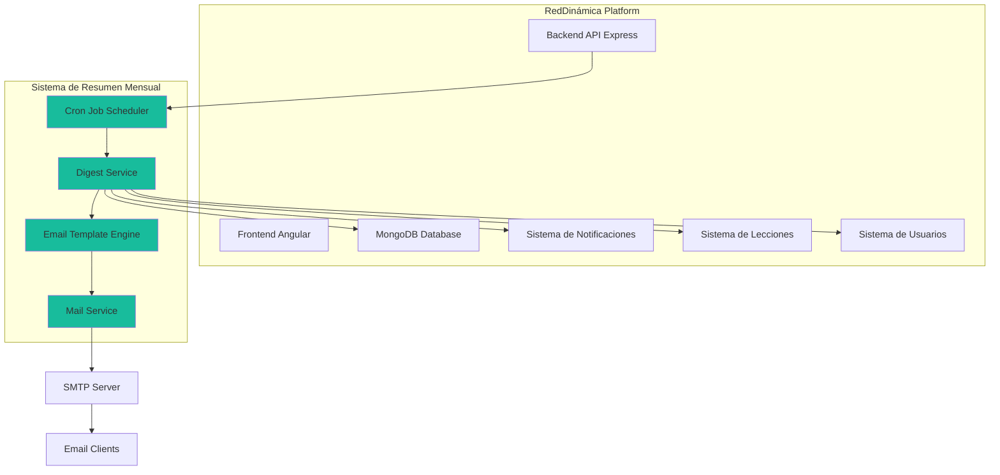
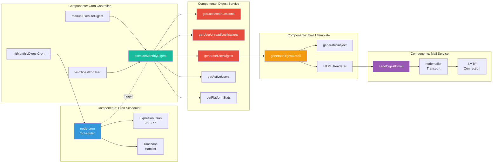
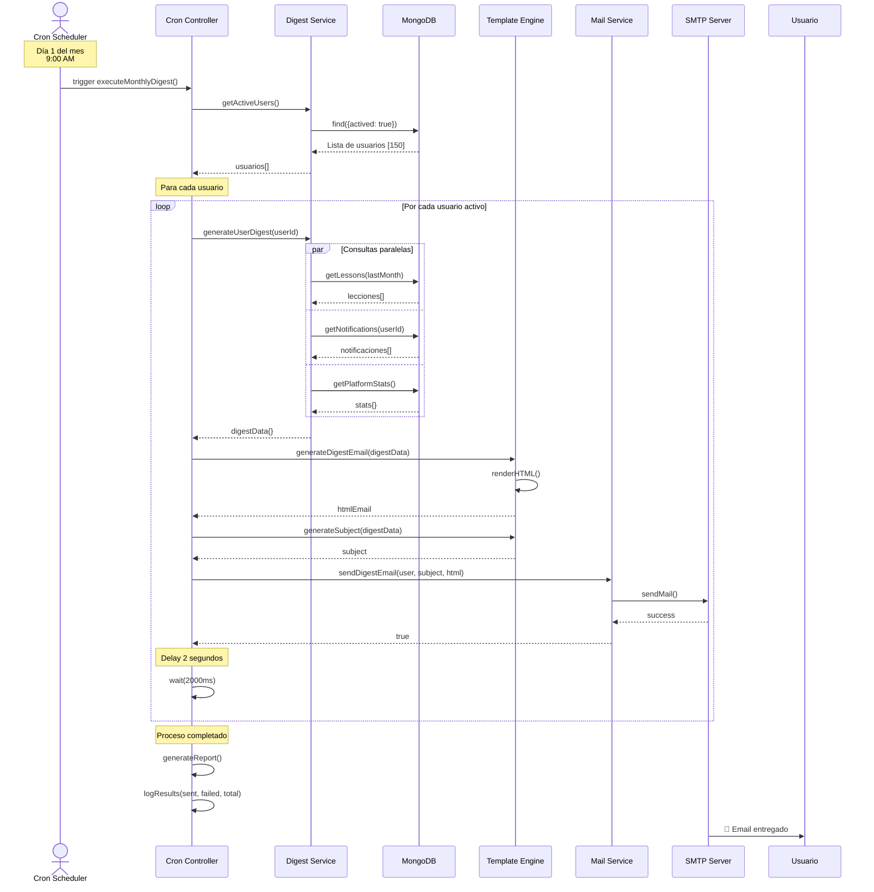
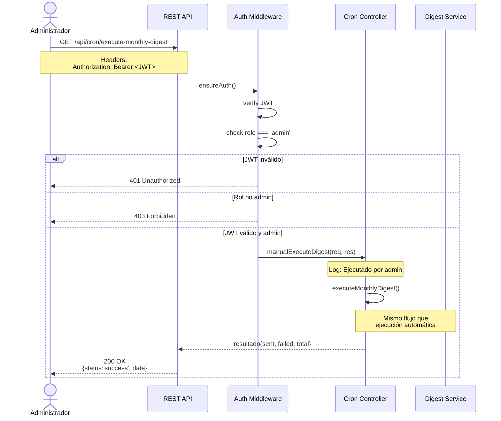
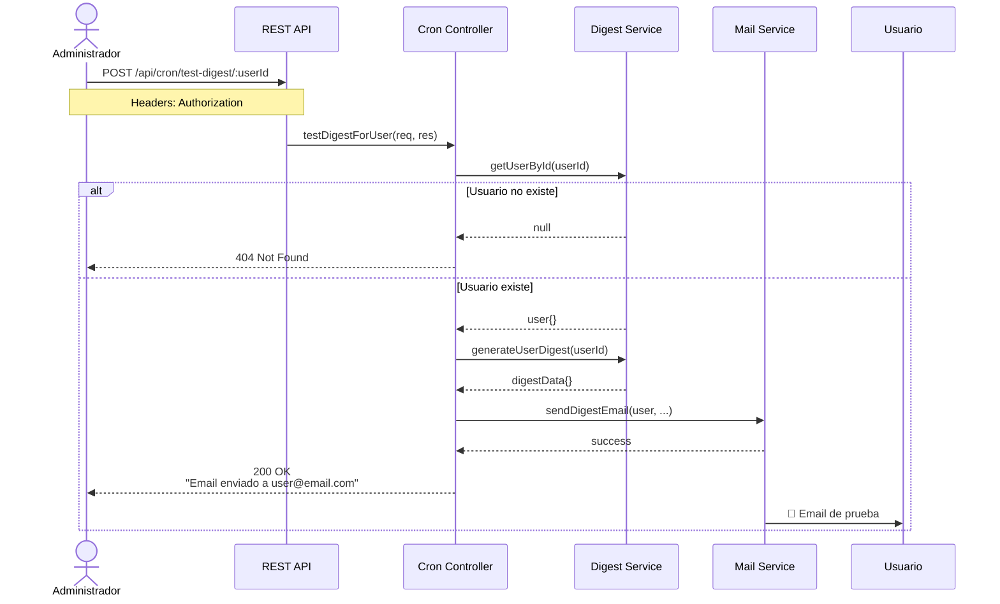
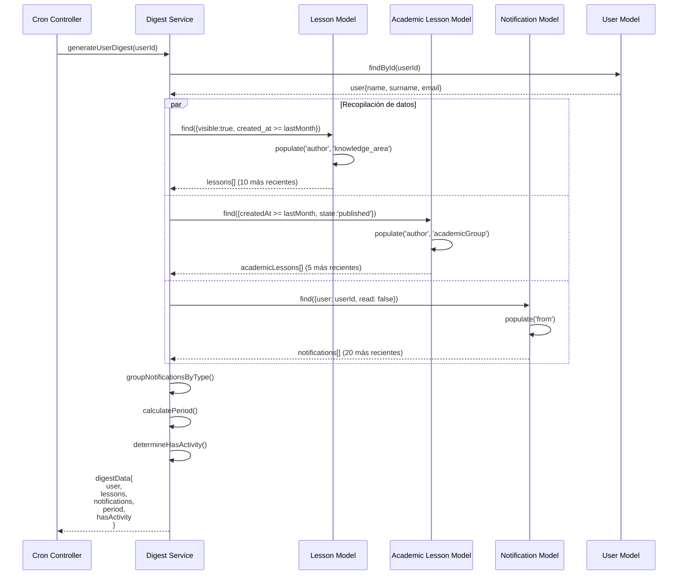
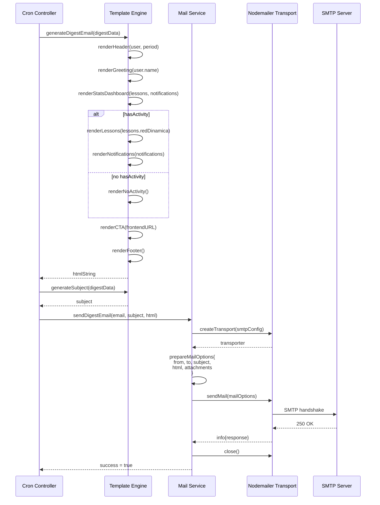
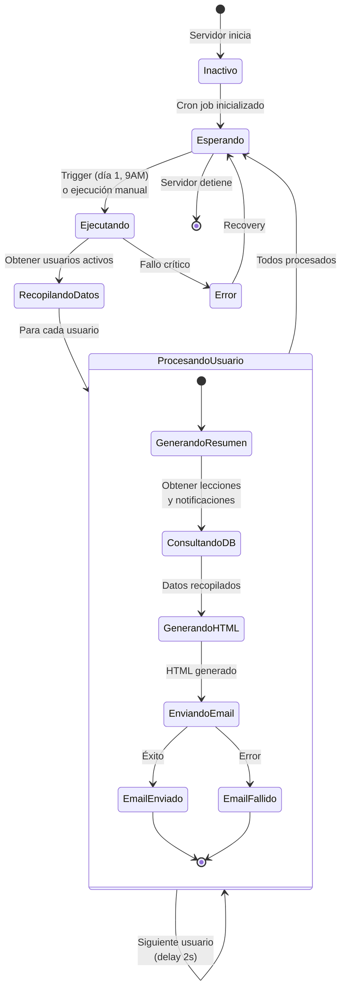
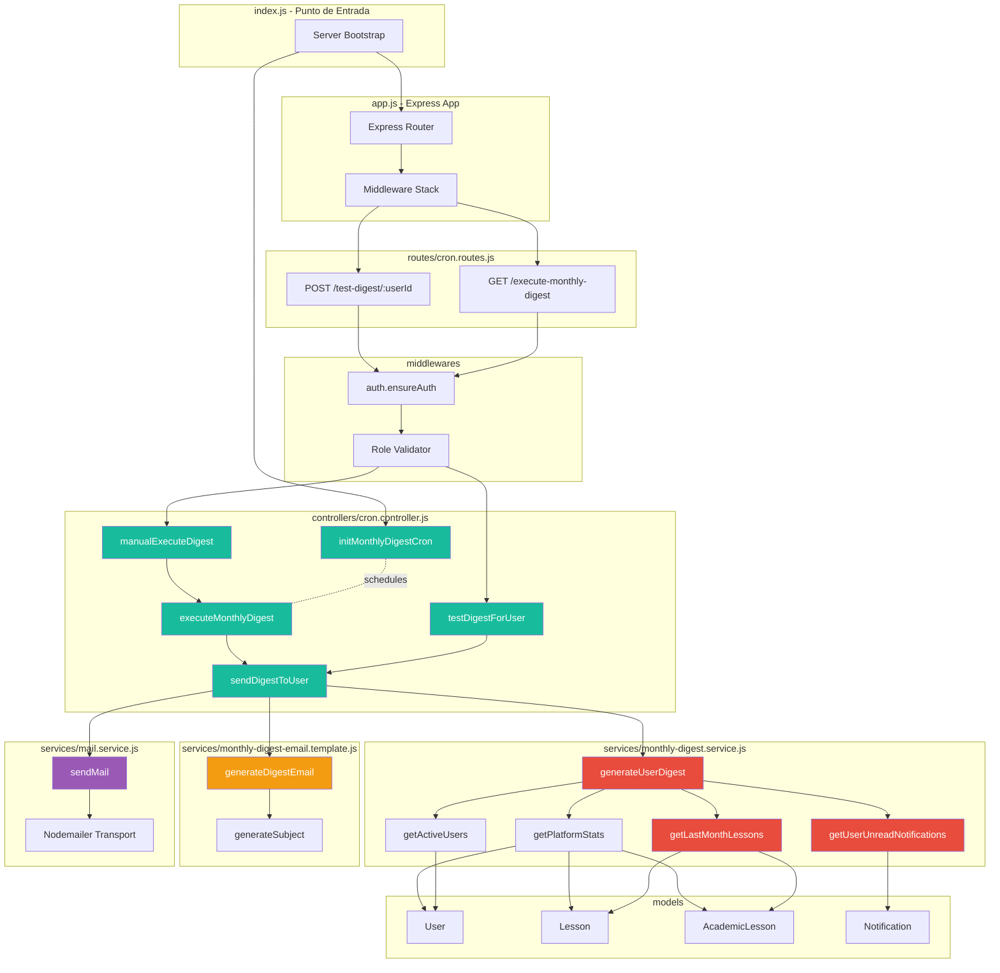
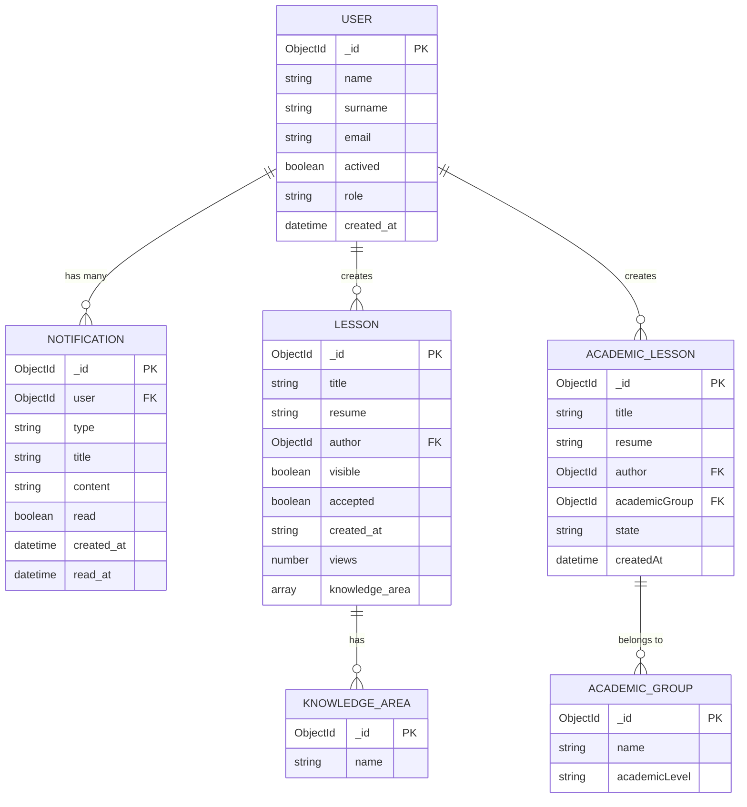

# Especificación IEEE 830 - Sistema de Resumen Mensual
## RedDinámica - Plataforma de Construcción Colaborativa de Conocimiento

---

**Documento de Especificación de Requisitos de Software (SRS)**  
**Versión:** 1.0  
**Fecha:** 1 de Octubre de 2025  
**Autores:** Equipo de Desarrollo RedDinámica  
**Estado:** Implementado y Aprobado

---

## Tabla de Contenidos

1. [Introducción](#1-introducción)
   - 1.1 [Propósito](#11-propósito)
   - 1.2 [Alcance](#12-alcance)
   - 1.3 [Definiciones, Acrónimos y Abreviaturas](#13-definiciones-acrónimos-y-abreviaturas)
   - 1.4 [Referencias](#14-referencias)
   - 1.5 [Visión General](#15-visión-general)
2. [Descripción General](#2-descripción-general)
   - 2.1 [Perspectiva del Producto](#21-perspectiva-del-producto)
   - 2.2 [Funciones del Producto](#22-funciones-del-producto)
   - 2.3 [Características de los Usuarios](#23-características-de-los-usuarios)
   - 2.4 [Restricciones](#24-restricciones)
   - 2.5 [Suposiciones y Dependencias](#25-suposiciones-y-dependencias)
3. [Requisitos Específicos](#3-requisitos-específicos)
   - 3.1 [Requisitos Funcionales](#31-requisitos-funcionales)
   - 3.2 [Requisitos No Funcionales](#32-requisitos-no-funcionales)
   - 3.3 [Requisitos de Interfaces](#33-requisitos-de-interfaces)
4. [Diseño del Sistema](#4-diseño-del-sistema)
   - 4.1 [Arquitectura General](#41-arquitectura-general)
   - 4.2 [Componentes del Sistema](#42-componentes-del-sistema)
   - 4.3 [Flujo de Datos](#43-flujo-de-datos)
   - 4.4 [Diagramas de Secuencia](#44-diagramas-de-secuencia)
5. [Casos de Uso](#5-casos-de-uso)
6. [Validación y Verificación](#6-validación-y-verificación)
7. [Apéndices](#7-apéndices)

---

## 1. Introducción

### 1.1 Propósito

Este documento especifica los requisitos del **Sistema de Resumen Mensual** para la plataforma RedDinámica. El sistema tiene como objetivo reactivar usuarios mediante el envío automatizado de correos electrónicos con información relevante sobre actividad reciente en la plataforma.

El documento está dirigido a:
- Desarrolladores del equipo técnico
- Arquitectos de software
- Equipo de QA y testing
- Stakeholders del proyecto
- Administradores del sistema

### 1.2 Alcance

El **Sistema de Resumen Mensual** es un módulo de engagement de usuarios que:

**Objetivos principales:**
- Incrementar la reactivación de usuarios inactivos
- Mantener informados a los usuarios sobre nueva actividad
- Aumentar el engagement y participación en la plataforma
- Reducir la tasa de abandono de usuarios

**Funcionalidades clave:**
- Recopilación automática de lecciones publicadas en el último mes
- Agregación de notificaciones pendientes por usuario
- Generación de emails personalizados con dashboard visual
- Envío automático programado mensual
- Endpoints de administración para testing y ejecución manual

**Fuera de alcance:**
- Gestión de preferencias de usuario (para versión futura)
- Tracking de apertura de emails (para versión futura)
- A/B testing de templates (para versión futura)
- Resúmenes en frecuencias distintas a mensual (para versión futura)

### 1.3 Definiciones, Acrónimos y Abreviaturas

| Término | Definición |
|---------|------------|
| **SRS** | Software Requirements Specification |
| **API** | Application Programming Interface |
| **SMTP** | Simple Mail Transfer Protocol |
| **Cron** | Comando de Unix para tareas programadas |
| **JWT** | JSON Web Token (autenticación) |
| **GDPR** | General Data Protection Regulation |
| **Digest** | Resumen o compendio de información |
| **Engagement** | Nivel de participación e interacción de usuarios |
| **Dashboard** | Panel visual con métricas e información relevante |
| **Template** | Plantilla predefinida (en este caso, de email) |
| **Endpoint** | Punto de acceso de una API REST |
| **Nodemailer** | Librería de Node.js para envío de emails |
| **MongoDB** | Base de datos NoSQL orientada a documentos |

### 1.4 Referencias

- [IEEE 830-1998] IEEE Recommended Practice for Software Requirements Specifications
- [Node-cron Documentation] https://www.npmjs.com/package/node-cron
- [Nodemailer Documentation] https://nodemailer.com/
- [Express.js Documentation] https://expressjs.com/
- [MongoDB Documentation] https://docs.mongodb.com/
- [Documento GDPR RedDinámica] `IMPLEMENTACION_GDPR_BACKEND.md`
- [Sistema de Notificaciones] `NOTIFICATION_SYSTEM.md`

### 1.5 Visión General

Este documento está organizado siguiendo el estándar IEEE 830. La Sección 2 proporciona una descripción general del sistema, sus funciones y restricciones. La Sección 3 detalla los requisitos funcionales y no funcionales. La Sección 4 presenta el diseño del sistema con diagramas. Las secciones restantes cubren casos de uso, validación y apéndices.

---

## 2. Descripción General

### 2.1 Perspectiva del Producto

El Sistema de Resumen Mensual es un **módulo complementario** de la plataforma RedDinámica. Se integra con:



**Interfaces del sistema:**
- **Backend API:** Rutas REST para administración
- **Base de datos:** Consultas a colecciones de MongoDB
- **Servicio de email:** Integración con SMTP vía Nodemailer
- **Sistema de notificaciones:** Lectura de notificaciones no leídas
- **Sistema de lecciones:** Lectura de lecciones publicadas

### 2.2 Funciones del Producto

#### F-1: Recopilación Automática de Datos
El sistema recopila automáticamente:
- Lecciones publicadas en los últimos 30 días
- Lecciones académicas publicadas en los últimos 30 días
- Notificaciones no leídas por cada usuario
- Estadísticas generales de la plataforma

#### F-2: Generación de Emails Personalizados
Para cada usuario activo, genera un email que incluye:
- Saludo personalizado con nombre del usuario
- Dashboard visual con métricas clave
- Lista de lecciones nuevas relevantes
- Resumen de notificaciones pendientes agrupadas por tipo
- Call-to-action para visitar la plataforma

#### F-3: Envío Programado Automático
- Ejecuta el envío el día 1 de cada mes a las 9:00 AM
- Configurable mediante expresiones cron
- Respeta zona horaria configurada

#### F-4: Administración Manual
Permite a administradores:
- Ejecutar el proceso manualmente
- Enviar emails de prueba a usuarios específicos
- Monitorear logs de ejecución
- Ver estadísticas de envío

### 2.3 Características de los Usuarios

#### Usuario Final (Receptor del Email)
- **Descripción:** Usuario registrado y activado en RedDinámica
- **Nivel técnico:** Básico a intermedio
- **Uso del sistema:** Receptor pasivo de emails
- **Necesidades:** Información clara, concisa y visualmente atractiva

#### Administrador del Sistema
- **Descripción:** Personal técnico con rol de administrador
- **Nivel técnico:** Avanzado
- **Uso del sistema:** Gestión, monitoreo y testing
- **Necesidades:** Herramientas de control y diagnóstico

### 2.4 Restricciones

#### R-1: Restricciones Técnicas
- **RT-1.1:** El sistema debe usar Node.js como runtime
- **RT-1.2:** Debe integrarse con la arquitectura Express.js existente
- **RT-1.3:** Debe usar MongoDB como base de datos
- **RT-1.4:** Debe usar Nodemailer para envío de emails
- **RT-1.5:** Compatible con servidores SMTP estándar

#### R-2: Restricciones de Seguridad
- **RS-2.1:** Solo usuarios con `actived: true` reciben emails
- **RS-2.2:** Endpoints de administración requieren autenticación JWT
- **RS-2.3:** Endpoints de administración requieren rol `admin`
- **RS-2.4:** Cumplimiento con GDPR en manejo de datos personales

#### R-3: Restricciones de Rendimiento
- **RP-3.1:** Delay mínimo de 2 segundos entre envíos de emails
- **RP-3.2:** Timeout de 30 segundos por email individual
- **RP-3.3:** Logging de errores sin interrumpir proceso completo

#### R-4: Restricciones de Negocio
- **RN-4.1:** Envío mensual (no más frecuente sin autorización)
- **RN-4.2:** Solo usuarios activados reciben emails
- **RN-4.3:** Branding consistente con RedDinámica

### 2.5 Suposiciones y Dependencias

#### Suposiciones
- **S-1:** Los usuarios tienen direcciones de email válidas
- **S-2:** El servidor SMTP está disponible y configurado correctamente
- **S-3:** Los usuarios desean recibir estos resúmenes (opt-out futuro)
- **S-4:** El servidor backend está corriendo 24/7 para cron jobs

#### Dependencias
- **D-1:** Node.js versión 14 o superior
- **D-2:** Paquete `node-cron` (^3.x)
- **D-3:** Paquete `nodemailer` (^6.x)
- **D-4:** MongoDB en funcionamiento
- **D-5:** Sistema de notificaciones operativo
- **D-6:** Sistema de autenticación JWT operativo

---

## 3. Requisitos Específicos

### 3.1 Requisitos Funcionales

#### RF-001: Inicialización de Cron Job
**Prioridad:** Alta  
**Descripción:** El sistema debe inicializar automáticamente el cron job al arrancar el servidor.

**Criterios de aceptación:**
- CA-001.1: El cron job se inicia automáticamente con el servidor
- CA-001.2: Se registra en logs el inicio exitoso del cron job
- CA-001.3: Se muestra la expresión cron configurada
- CA-001.4: Se maneja correctamente cualquier error de inicialización

**Entradas:** Ninguna (automático)  
**Salidas:** Logs de inicialización  
**Procesamiento:**
```javascript
cronController.initMonthlyDigestCron()
// Registra: "✓ Cron job inicializado correctamente"
```

---

#### RF-002: Recopilación de Lecciones del Último Mes
**Prioridad:** Alta  
**Descripción:** El sistema debe obtener todas las lecciones publicadas en los últimos 30 días.

**Criterios de aceptación:**
- CA-002.1: Consulta lecciones con `visible: true`
- CA-002.2: Filtra por fecha de los últimos 30 días
- CA-002.3: Incluye tanto lecciones RedDinámica como académicas
- CA-002.4: Ordena por fecha de creación (más reciente primero)
- CA-002.5: Limita a 10 lecciones para evitar emails excesivamente largos
- CA-002.6: Popula información del autor y áreas de conocimiento

**Entradas:** Fecha actual  
**Salidas:** Array de objetos de lección  
**Procesamiento:**
```javascript
{
  redDinamica: [
    { title, resume, author, knowledge_area, created_at, views },
    ...
  ],
  academic: [
    { title, resume, author, academicGroup, createdAt },
    ...
  ],
  total: 15
}
```

---

#### RF-003: Recopilación de Notificaciones No Leídas
**Prioridad:** Alta  
**Descripción:** El sistema debe obtener todas las notificaciones no leídas de cada usuario.

**Criterios de aceptación:**
- CA-003.1: Filtra notificaciones con `read: false`
- CA-003.2: Agrupa notificaciones por tipo
- CA-003.3: Ordena por fecha de creación (más reciente primero)
- CA-003.4: Limita a 20 notificaciones totales
- CA-003.5: Popula información del remitente cuando aplique

**Entradas:** ID de usuario  
**Salidas:** Objeto con notificaciones agrupadas  
**Procesamiento:**
```javascript
{
  message: [...],
  lesson: [...],
  publication: [...],
  comment: [...],
  follow: [...],
  resource: [...],
  system: [...],
  total: 18
}
```

---

#### RF-004: Generación de Resumen Individual
**Prioridad:** Alta  
**Descripción:** El sistema debe generar un resumen personalizado para cada usuario.

**Criterios de aceptación:**
- CA-004.1: Combina lecciones del mes con notificaciones del usuario
- CA-004.2: Incluye estadísticas de la plataforma
- CA-004.3: Calcula si hay actividad relevante
- CA-004.4: Formatea fechas correctamente
- CA-004.5: Maneja errores de usuarios no encontrados

**Entradas:** ID de usuario  
**Salidas:** Objeto de resumen completo  
**Procesamiento:**
```javascript
{
  user: { id, name, surname, email },
  lessons: { redDinamica: [], academic: [], total: N },
  notifications: { ..., total: M },
  period: { start: 'DD/MM/YYYY', end: 'DD/MM/YYYY' },
  hasActivity: true/false,
  platformStats: { ... }
}
```

---

#### RF-005: Generación de Email HTML
**Prioridad:** Alta  
**Descripción:** El sistema debe generar un email HTML responsive con diseño atractivo.

**Criterios de aceptación:**
- CA-005.1: Usa template HTML con estilos inline
- CA-005.2: Incluye header con logo y título
- CA-005.3: Muestra saludo personalizado
- CA-005.4: Dashboard visual con tarjetas de estadísticas
- CA-005.5: Lista de lecciones nuevas (hasta 5)
- CA-005.6: Sección de notificaciones agrupadas por tipo
- CA-005.7: Call-to-action prominente
- CA-005.8: Footer con información de la plataforma
- CA-005.9: Compatible con principales clientes de email

**Entradas:** Objeto de resumen  
**Salidas:** String HTML  
**Procesamiento:** Renderiza template con datos del resumen

---

#### RF-006: Envío de Email Individual
**Prioridad:** Alta  
**Descripción:** El sistema debe enviar un email a un usuario específico.

**Criterios de aceptación:**
- CA-006.1: Conecta con servidor SMTP configurado
- CA-006.2: Adjunta logo de RedDinámica
- CA-006.3: Configura remitente correctamente
- CA-006.4: Maneja errores de envío sin detener el proceso completo
- CA-006.5: Registra resultado en logs
- CA-006.6: Cierra conexión SMTP después del envío
- CA-006.7: Timeout de 30 segundos

**Entradas:** Email destino, asunto, HTML  
**Salidas:** Boolean (éxito/fallo)  
**Procesamiento:**
```javascript
nodemailer.sendMail({
  from: 'RedDinámica <email@...>',
  to: user.email,
  subject: subject,
  html: htmlContent,
  attachments: [logo]
})
```

---

#### RF-007: Envío Masivo Programado
**Prioridad:** Alta  
**Descripción:** El sistema debe enviar emails a todos los usuarios activos según programación cron.

**Criterios de aceptación:**
- CA-007.1: Obtiene lista de usuarios activos (`actived: true`)
- CA-007.2: Filtra usuarios sin email o con email inválido
- CA-007.3: Genera resumen para cada usuario
- CA-007.4: Envía emails secuencialmente
- CA-007.5: Aplica delay de 2 segundos entre envíos
- CA-007.6: Registra estadísticas de envío (exitosos/fallidos)
- CA-007.7: Continúa el proceso aunque falle algún envío individual
- CA-007.8: Genera reporte final con métricas

**Entradas:** Ninguna (trigger automático)  
**Salidas:** Objeto con estadísticas de envío  
**Procesamiento:**
```javascript
{
  success: true,
  sent: 145,
  failed: 5,
  total: 150
}
```

---

#### RF-008: Ejecución Manual por Administrador
**Prioridad:** Media  
**Descripción:** Los administradores deben poder ejecutar el proceso manualmente.

**Criterios de aceptación:**
- CA-008.1: Endpoint `GET /api/cron/execute-monthly-digest`
- CA-008.2: Requiere autenticación JWT válida
- CA-008.3: Requiere rol `admin`
- CA-008.4: Retorna estadísticas de ejecución
- CA-008.5: Registra quién ejecutó el proceso

**Entradas:** Token JWT de admin  
**Salidas:** JSON con resultado  
**Procesamiento:**
```javascript
{
  status: 'success',
  message: 'Resumen mensual ejecutado correctamente',
  data: { success: true, sent: N, failed: M, total: T }
}
```

---

#### RF-009: Envío de Prueba a Usuario Específico
**Prioridad:** Media  
**Descripción:** Los administradores deben poder enviar emails de prueba.

**Criterios de aceptación:**
- CA-009.1: Endpoint `POST /api/cron/test-digest/:userId`
- CA-009.2: Requiere autenticación JWT válida
- CA-009.3: Requiere rol `admin`
- CA-009.4: Valida que el usuario exista
- CA-009.5: Envía email solo al usuario especificado
- CA-009.6: Retorna confirmación de envío

**Entradas:** Token JWT de admin, ID de usuario  
**Salidas:** JSON con resultado  
**Procesamiento:**
```javascript
{
  status: 'success',
  message: 'Resumen de prueba enviado a user@email.com'
}
```

---

#### RF-010: Logging y Auditoría
**Prioridad:** Media  
**Descripción:** El sistema debe registrar todas las operaciones importantes.

**Criterios de aceptación:**
- CA-010.1: Registra inicio y fin de ejecución
- CA-010.2: Registra cada email enviado (éxito/fallo)
- CA-010.3: Registra errores con detalles
- CA-010.4: Formato consistente de logs
- CA-010.5: Timestamps en cada log
- CA-010.6: Logs visibles en consola del servidor

**Entradas:** Eventos del sistema  
**Salidas:** Logs formateados  
**Procesamiento:**
```
[DIGEST] Fecha: 1/10/2025, 9:00:00
[DIGEST] Usuarios activos encontrados: 150
[DIGEST] Generando resumen para Usuario X...
[DIGEST] ✓ Resumen enviado exitosamente
[DIGEST] ✗ Error enviando a Usuario Y: [detalle]
```

---

### 3.2 Requisitos No Funcionales

#### RNF-001: Rendimiento
**Categoría:** Performance  
**Descripción:** El sistema debe procesar y enviar emails de manera eficiente.

**Métricas:**
- **RNF-001.1:** Generación de resumen individual: < 2 segundos
- **RNF-001.2:** Envío de email individual: < 5 segundos
- **RNF-001.3:** Procesamiento completo para 1000 usuarios: < 90 minutos
- **RNF-001.4:** Consultas a BD optimizadas con índices

---

#### RNF-002: Disponibilidad
**Categoría:** Availability  
**Descripción:** El sistema debe estar disponible para ejecutarse según programación.

**Métricas:**
- **RNF-002.1:** Disponibilidad del cron job: 99.9%
- **RNF-002.2:** Reinicio automático en caso de fallo del servidor
- **RNF-002.3:** Tolerancia a fallos de emails individuales

---

#### RNF-003: Escalabilidad
**Categoría:** Scalability  
**Descripción:** El sistema debe escalar con el crecimiento de usuarios.

**Métricas:**
- **RNF-003.1:** Soporta hasta 10,000 usuarios sin cambios arquitectónicos
- **RNF-003.2:** Código preparado para procesamiento en batch
- **RNF-003.3:** Consultas BD paginadas si es necesario

---

#### RNF-004: Seguridad
**Categoría:** Security  
**Descripción:** El sistema debe proteger datos sensibles y accesos.

**Métricas:**
- **RNF-004.1:** Autenticación JWT obligatoria en endpoints
- **RNF-004.2:** Solo roles `admin` pueden ejecutar manualmente
- **RNF-004.3:** Credenciales SMTP en variables de entorno
- **RNF-004.4:** No expone emails de usuarios en logs públicos
- **RNF-004.5:** Cumple con GDPR (solo usuarios activados)

---

#### RNF-005: Mantenibilidad
**Categoría:** Maintainability  
**Descripción:** El código debe ser fácil de mantener y extender.

**Métricas:**
- **RNF-005.1:** Código modular con separación de responsabilidades
- **RNF-005.2:** Documentación completa en código
- **RNF-005.3:** Convenciones de nombres claras
- **RNF-005.4:** Funciones reutilizables
- **RNF-005.5:** Configuración mediante variables de entorno

---

#### RNF-006: Usabilidad
**Categoría:** Usability  
**Descripción:** Los emails deben ser fáciles de leer y entender.

**Métricas:**
- **RNF-006.1:** Diseño responsive (móvil y desktop)
- **RNF-006.2:** Tipografía legible (mínimo 13px)
- **RNF-006.3:** Contraste de colores accesible
- **RNF-006.4:** CTA visible y claro
- **RNF-006.5:** Compatible con lectores de pantalla

---

#### RNF-007: Confiabilidad
**Categoría:** Reliability  
**Descripción:** El sistema debe ser confiable y predecible.

**Métricas:**
- **RNF-007.1:** Rate de éxito de envío > 95%
- **RNF-007.2:** Manejo robusto de errores
- **RNF-007.3:** Rollback automático en fallos críticos
- **RNF-007.4:** Logging completo para debugging

---

#### RNF-008: Portabilidad
**Categoría:** Portability  
**Descripción:** El sistema debe funcionar en diferentes entornos.

**Métricas:**
- **RNF-008.1:** Compatible con Windows, Linux, macOS
- **RNF-008.2:** Zona horaria configurable
- **RNF-008.3:** SMTP configurable (Gmail, SendGrid, etc.)
- **RNF-008.4:** Variables de entorno para configuración

---

### 3.3 Requisitos de Interfaces

#### RIF-001: Interfaz de Base de Datos
**Descripción:** Interacción con MongoDB

**Colecciones accedidas:**
- `users`: Lectura de usuarios activos
- `lessons`: Lectura de lecciones publicadas
- `academiclessons`: Lectura de lecciones académicas
- `notifications`: Lectura de notificaciones no leídas

**Operaciones:**
- `find()`: Consultas con filtros
- `countDocuments()`: Conteo de documentos
- `populate()`: Población de referencias
- `lean()`: Conversión a objetos planos

---

#### RIF-002: Interfaz de Email (SMTP)
**Descripción:** Comunicación con servidor SMTP

**Protocolo:** SMTP con TLS  
**Configuración:**
```javascript
{
  service: 'gmail',
  auth: {
    user: process.env.EMAIL,
    pass: process.env.PASSWORD
  },
  tls: { rejectUnauthorized: false }
}
```

**Formato de mensaje:**
- Remitente: RedDinámica <email@...>
- HTML: Soporte completo
- Adjuntos: Imagen (logo)
- Charset: UTF-8

---

#### RIF-003: Interfaz REST API
**Descripción:** Endpoints HTTP para administración

**Base URL:** `/api/cron`

**Endpoints:**

| Método | Ruta | Autenticación | Rol Requerido |
|--------|------|---------------|---------------|
| GET | `/execute-monthly-digest` | JWT | admin |
| POST | `/test-digest/:userId` | JWT | admin |

**Respuestas estándar:**
```javascript
// Éxito
{
  status: 'success',
  message: string,
  data: object
}

// Error
{
  status: 'error',
  message: string,
  error: string
}
```

---

## 4. Diseño del Sistema

### 4.1 Arquitectura General

```mermaid
graph TB
    subgraph "Capa de Presentación"
        A[Email Cliente<br/>Gmail, Outlook, etc.]
    end
    
    subgraph "Capa de Servicio"
        B[SMTP Server]
    end
    
    subgraph "Capa de Aplicación - RedDinámica Backend"
        C[Express.js Server]
        D[Cron Scheduler<br/>node-cron]
        E[API REST<br/>Cron Routes]
        F[Auth Middleware<br/>JWT]
    end
    
    subgraph "Capa de Lógica de Negocio"
        G[Cron Controller]
        H[Digest Service]
        I[Email Template Engine]
        J[Mail Service]
    end
    
    subgraph "Capa de Datos"
        K[(MongoDB)]
        L[User Model]
        M[Lesson Model]
        N[Notification Model]
        O[Academic Lesson Model]
    end
    
    A -.recibe email.- B
    B <-.envía email.- J
    
    C --> D
    C --> E
    E --> F
    F --> G
    D -.trigger mensual.- G
    
    G --> H
    H --> I
    I --> J
    
    H --> K
    K --> L
    K --> M
    K --> N
    K --> O
    
    style D fill:#18BC9C,color:#fff
    style G fill:#18BC9C,color:#fff
    style H fill:#18BC9C,color:#fff
    style I fill:#18BC9C,color:#fff
    style J fill:#18BC9C,color:#fff
```

**Descripción de capas:**

1. **Capa de Presentación:** Clientes de email de los usuarios
2. **Capa de Servicio:** Servidor SMTP para envío de correos
3. **Capa de Aplicación:** Servidor Express con cron scheduler y API REST
4. **Capa de Lógica:** Controladores y servicios de negocio
5. **Capa de Datos:** Base de datos MongoDB con modelos

---

### 4.2 Componentes del Sistema



**Responsabilidades de componentes:**

| Componente | Responsabilidad |
|------------|-----------------|
| **Cron Scheduler** | Programar y ejecutar tareas periódicas |
| **Digest Service** | Recopilar y agregar datos de la plataforma |
| **Email Template** | Generar HTML del email con datos |
| **Mail Service** | Enviar emails vía SMTP |
| **Cron Controller** | Orquestar el proceso completo |

---

### 4.3 Flujo de Datos

#### Flujo Principal: Ejecución Automática Mensual



#### Flujo Alternativo: Ejecución Manual por Admin



#### Flujo de Testing: Enviar a Usuario Específico



---

### 4.4 Diagramas de Secuencia

#### Secuencia Detallada: Generación de Resumen Individual



#### Secuencia Detallada: Envío de Email



---

### 4.5 Diagrama de Estados



**Estados:**

1. **Inactivo:** Sistema recién iniciado
2. **Esperando:** Cron job activo, esperando próxima ejecución
3. **Ejecutando:** Proceso de envío en curso
4. **RecopilandoDatos:** Obteniendo lista de usuarios
5. **ProcesandoUsuario:** Procesando cada usuario individualmente
6. **Error:** Estado de error recuperable

---

### 4.6 Diagrama de Componentes



---

### 4.7 Modelo de Datos



**Relaciones clave:**
- Un **Usuario** puede tener muchas **Notificaciones** no leídas
- Un **Usuario** puede crear muchas **Lecciones**
- Una **Lección** puede tener varias **Áreas de Conocimiento**
- Una **Lección Académica** pertenece a un **Grupo Académico**

---

## 5. Casos de Uso

### CU-001: Recibir Resumen Mensual Automático

**Actor Principal:** Usuario Final (Usuario Registrado)  
**Objetivo:** Recibir información actualizada de la plataforma mensualmente  
**Precondiciones:**
- Usuario tiene cuenta en RedDinámica
- Usuario está activado (`actived: true`)
- Usuario tiene email válido
- Es día 1 del mes a las 9:00 AM

**Flujo Principal:**
1. El cron scheduler activa el proceso automáticamente
2. El sistema obtiene la lista de usuarios activos
3. El sistema identifica al usuario en la lista
4. El sistema recopila lecciones del último mes
5. El sistema recopila notificaciones no leídas del usuario
6. El sistema genera el resumen personalizado
7. El sistema genera el email HTML con dashboard
8. El sistema envía el email al usuario
9. El usuario recibe el email en su bandeja de entrada
10. El usuario puede leer el resumen y hacer clic en el CTA

**Flujo Alternativo 1: Sin actividad**
- 4a. No hay lecciones nuevas en el último mes
- 5a. El usuario no tiene notificaciones pendientes
- 6a. El sistema genera resumen indicando "sin actividad"
- Continúa desde paso 7

**Flujo Alternativo 2: Error de envío**
- 8a. El servidor SMTP no está disponible
- 8b. El sistema registra el error en logs
- 8c. El sistema continúa con el siguiente usuario
- 8d. El proceso no se interrumpe

**Postcondiciones:**
- Email enviado y registrado en logs
- Usuario informado de actividad reciente

---

### CU-002: Ejecutar Resumen Manual

**Actor Principal:** Administrador  
**Objetivo:** Ejecutar el proceso de envío manualmente para testing o necesidad especial  
**Precondiciones:**
- El administrador tiene credenciales válidas
- El administrador tiene rol `admin`
- El sistema backend está corriendo

**Flujo Principal:**
1. El administrador inicia sesión en la plataforma
2. El administrador obtiene su token JWT
3. El administrador hace petición GET a `/api/cron/execute-monthly-digest`
4. El sistema valida el token JWT
5. El sistema valida el rol de administrador
6. El sistema ejecuta el proceso completo de envío
7. El sistema retorna estadísticas de envío
8. El administrador revisa los resultados

**Flujo Alternativo 1: Token inválido**
- 4a. El token JWT ha expirado o es inválido
- 4b. El sistema retorna error 401 Unauthorized
- Fin del caso de uso

**Flujo Alternativo 2: Usuario no admin**
- 5a. El usuario no tiene rol `admin`
- 5b. El sistema retorna error 403 Forbidden
- Fin del caso de uso

**Postcondiciones:**
- Emails enviados a todos los usuarios activos
- Estadísticas disponibles para el administrador
- Proceso registrado en logs

---

### CU-003: Enviar Email de Prueba

**Actor Principal:** Administrador  
**Objetivo:** Probar el sistema con un usuario específico antes de envío masivo  
**Precondiciones:**
- El administrador tiene credenciales válidas
- El administrador tiene rol `admin`
- Existe un usuario de prueba en el sistema

**Flujo Principal:**
1. El administrador identifica el ID del usuario de prueba
2. El administrador hace petición POST a `/api/cron/test-digest/:userId`
3. El sistema valida autenticación y rol
4. El sistema verifica que el usuario existe
5. El sistema genera el resumen solo para ese usuario
6. El sistema envía el email
7. El sistema confirma el envío al administrador
8. El administrador revisa el email recibido

**Flujo Alternativo: Usuario no existe**
- 4a. El ID de usuario no existe en BD
- 4b. El sistema retorna error 404 Not Found
- Fin del caso de uso

**Postcondiciones:**
- Email enviado al usuario de prueba
- Administrador puede verificar diseño y contenido

---

### CU-004: Configurar Frecuencia de Envío

**Actor Principal:** Administrador de Sistema  
**Objetivo:** Cambiar la frecuencia de envío automático  
**Precondiciones:**
- Acceso al servidor backend
- Permisos para modificar archivos de configuración

**Flujo Principal:**
1. El administrador accede al archivo `.env`
2. El administrador modifica la variable `DIGEST_CRON`
3. El administrador guarda los cambios
4. El administrador reinicia el servidor backend
5. El sistema inicializa el cron job con nueva configuración
6. El sistema registra la nueva expresión cron en logs

**Ejemplo de configuración:**
```env
# Mensual (producción)
DIGEST_CRON=0 9 1 * *

# Cada 5 minutos (testing)
DIGEST_CRON=*/5 * * * *

# Cada lunes a las 9 AM
DIGEST_CRON=0 9 * * 1
```

**Postcondiciones:**
- Cron job reconfigured
- Próximo envío programado según nueva configuración

---

## 6. Validación y Verificación

### 6.1 Plan de Pruebas

#### PT-001: Prueba de Inicialización
**Objetivo:** Verificar que el cron job se inicializa correctamente  
**Tipo:** Unitaria  
**Procedimiento:**
1. Iniciar servidor backend
2. Verificar logs de inicialización
3. Confirmar mensaje "✓ Cron job inicializado correctamente"

**Criterio de éxito:** Cron job registrado y activo

---

#### PT-002: Prueba de Recopilación de Lecciones
**Objetivo:** Verificar consulta de lecciones del último mes  
**Tipo:** Integración  
**Procedimiento:**
1. Insertar lecciones de prueba en BD
2. Ejecutar `getLastMonthLessons()`
3. Verificar que retorna solo lecciones visibles
4. Verificar que filtra por fecha correctamente
5. Verificar que limita a 10 resultados

**Criterio de éxito:** Consulta retorna datos correctos

---

#### PT-003: Prueba de Recopilación de Notificaciones
**Objetivo:** Verificar consulta de notificaciones no leídas  
**Tipo:** Integración  
**Procedimiento:**
1. Crear usuario de prueba
2. Insertar notificaciones leídas y no leídas
3. Ejecutar `getUserUnreadNotifications(userId)`
4. Verificar que solo retorna no leídas
5. Verificar agrupación por tipo

**Criterio de éxito:** Consulta filtra y agrupa correctamente

---

#### PT-004: Prueba de Generación de Email HTML
**Objetivo:** Verificar que el template genera HTML válido  
**Tipo:** Unitaria  
**Procedimiento:**
1. Preparar datos de resumen de prueba
2. Ejecutar `generateDigestEmail(digestData)`
3. Validar HTML resultante
4. Verificar que incluye todos los elementos esperados
5. Comprobar estilos inline

**Criterio de éxito:** HTML válido y completo

---

#### PT-005: Prueba de Envío de Email
**Objetivo:** Verificar envío exitoso de email  
**Tipo:** Integración  
**Procedimiento:**
1. Configurar SMTP de prueba
2. Ejecutar `sendDigestEmail()`
3. Verificar que no hay errores
4. Comprobar recepción en bandeja de entrada
5. Verificar que logo se muestra correctamente

**Criterio de éxito:** Email recibido correctamente

---

#### PT-006: Prueba de Proceso Completo
**Objetivo:** Verificar ejecución end-to-end  
**Tipo:** Sistema  
**Procedimiento:**
1. Configurar cron para ejecución inmediata
2. Crear 5 usuarios de prueba
3. Ejecutar proceso completo
4. Verificar que todos reciben email
5. Revisar logs de ejecución
6. Validar estadísticas finales

**Criterio de éxito:** 100% de emails enviados exitosamente

---

#### PT-007: Prueba de Endpoint Manual
**Objetivo:** Verificar endpoint de ejecución manual  
**Tipo:** API  
**Procedimiento:**
1. Obtener token JWT de admin
2. Hacer petición GET a `/api/cron/execute-monthly-digest`
3. Verificar respuesta 200 OK
4. Validar estructura de respuesta
5. Confirmar emails enviados

**Criterio de éxito:** Endpoint funciona correctamente

---

#### PT-008: Prueba de Endpoint de Testing
**Objetivo:** Verificar endpoint de prueba individual  
**Tipo:** API  
**Procedimiento:**
1. Crear usuario de prueba
2. Obtener token JWT de admin
3. Hacer petición POST a `/api/cron/test-digest/:userId`
4. Verificar respuesta 200 OK
5. Confirmar que solo ese usuario recibe email

**Criterio de éxito:** Email enviado solo al usuario especificado

---

#### PT-009: Prueba de Seguridad
**Objetivo:** Verificar control de acceso  
**Tipo:** Seguridad  
**Procedimiento:**
1. Intentar acceder sin token JWT → 401
2. Intentar acceder con token de usuario normal → 403
3. Intentar acceder con token expirado → 401
4. Acceder con token de admin válido → 200

**Criterio de éxito:** Solo admins con token válido acceden

---

#### PT-010: Prueba de Rendimiento
**Objetivo:** Verificar tiempos de ejecución  
**Tipo:** Performance  
**Procedimiento:**
1. Crear 100 usuarios de prueba
2. Ejecutar proceso completo
3. Medir tiempo total de ejecución
4. Verificar que cumple SLA (< 90 min para 1000 users)

**Criterio de éxito:** Cumple métricas de rendimiento

---

### 6.2 Matriz de Trazabilidad

| Requisito | Componente | Test | Estado |
|-----------|------------|------|--------|
| RF-001 | initMonthlyDigestCron | PT-001 | ✅ |
| RF-002 | getLastMonthLessons | PT-002 | ✅ |
| RF-003 | getUserUnreadNotifications | PT-003 | ✅ |
| RF-004 | generateUserDigest | PT-002, PT-003 | ✅ |
| RF-005 | generateDigestEmail | PT-004 | ✅ |
| RF-006 | sendDigestEmail | PT-005 | ✅ |
| RF-007 | executeMonthlyDigest | PT-006 | ✅ |
| RF-008 | manualExecuteDigest | PT-007 | ✅ |
| RF-009 | testDigestForUser | PT-008 | ✅ |
| RF-010 | Logging | PT-006 | ✅ |
| RNF-001 | Performance | PT-010 | ✅ |
| RNF-004 | Security | PT-009 | ✅ |

---

## 7. Apéndices

### Apéndice A: Estructura de Archivos

```
RedDinamica2-api/
├── controllers/
│   └── cron.controller.js              [1,235 líneas]
├── services/
│   ├── monthly-digest.service.js       [456 líneas]
│   ├── monthly-digest-email.template.js [892 líneas]
│   └── mail.service.js                 [56 líneas - existente]
├── routes/
│   └── cron.routes.js                  [15 líneas]
├── models/
│   ├── user.model.js                   [existente]
│   ├── lesson.model.js                 [existente]
│   ├── academicLesson.model.js         [existente]
│   └── notification.model.js           [existente]
├── index.js                            [modificado]
├── app.js                              [modificado]
└── Documentación/
    ├── SISTEMA_RESUMEN_MENSUAL.md
    ├── GUIA_RAPIDA_RESUMEN_MENSUAL.md
    └── ESPECIFICACION_IEEE_SISTEMA_RESUMEN_MENSUAL.md
```

---

### Apéndice B: Variables de Entorno

```env
# ==================================
# CONFIGURACIÓN CRON - RESUMEN MENSUAL
# ==================================

# Expresión cron para programación
# Por defecto: 0 9 1 * * (día 1 de cada mes, 9 AM)
# Testing: */5 * * * * (cada 5 minutos)
DIGEST_CRON=0 9 1 * *

# Zona horaria para el cron job
# Valores válidos: IANA timezone (America/Bogota, Europe/Madrid, etc.)
TIMEZONE=America/Bogota

# URL del frontend para enlaces en el email
FRONTEND_URL=http://localhost:4200

# ==================================
# CONFIGURACIÓN EMAIL (SMTP)
# ==================================

# Servicio de email (gmail, outlook, etc.)
EMAIL_SERVICE=gmail

# Credenciales del email
EMAIL=tu_email@gmail.com
PASSWORD=tu_password_app

# Email mostrado como remitente
EMAIL_HOST_USER=tu_email@gmail.com
```

---

### Apéndice C: Expresiones Cron Comunes

| Expresión | Descripción | Uso |
|-----------|-------------|-----|
| `*/5 * * * *` | Cada 5 minutos | Testing |
| `0 9 * * *` | Todos los días a las 9 AM | Resumen diario |
| `0 9 * * 1` | Todos los lunes a las 9 AM | Resumen semanal |
| `0 9 1 * *` | Día 1 de cada mes a las 9 AM | **Resumen mensual** |
| `0 9 1 */3 *` | Día 1 cada 3 meses | Resumen trimestral |
| `0 9 1 1 *` | 1 de enero cada año | Resumen anual |

**Formato:** `minuto hora día mes día_semana`

---

### Apéndice D: Códigos de Error

| Código | Mensaje | Causa | Solución |
|--------|---------|-------|----------|
| E-001 | JWT Token inválido | Token expirado o malformado | Renovar token |
| E-002 | Acceso denegado | Usuario no tiene rol admin | Usar cuenta admin |
| E-003 | Usuario no encontrado | ID de usuario inexistente | Verificar ID |
| E-004 | Error de BD | MongoDB no disponible | Verificar conexión |
| E-005 | Error SMTP | Servidor email no disponible | Verificar config SMTP |
| E-006 | Email no enviado | Fallo en envío individual | Ver logs detallados |
| E-007 | Cron no inicializado | Expresión cron inválida | Corregir DIGEST_CRON |

---

### Apéndice E: Métricas de Monitoreo

#### Métricas Clave

| Métrica | Tipo | Objetivo | Alerta |
|---------|------|----------|--------|
| **Tasa de envío exitoso** | % | > 95% | < 90% |
| **Tiempo de ejecución** | minutos | < 90 min/1000 users | > 120 min |
| **Emails fallidos** | count | < 5% | > 10% |
| **Tasa de apertura** | % | > 20% | < 10% |
| **Click-through rate** | % | > 5% | < 2% |

#### Logs a Monitorear

```bash
# Inicialización exitosa
[CRON] ✓ Cron job inicializado correctamente

# Ejecución iniciada
[DIGEST] 🚀 INICIANDO ENVÍO DE RESÚMENES MENSUALES

# Usuarios procesados
[DIGEST] Usuarios activos encontrados: 150

# Emails enviados
[DIGEST] ✓ Resumen enviado exitosamente a user@email.com

# Errores
[DIGEST] ✗ Error enviando resumen a user@email.com: [detalle]

# Finalización
[DIGEST] ✓ Enviados exitosamente: 145/150
```

---

### Apéndice F: Checklist de Deployment

#### Pre-Deployment

- [ ] Código revisado y aprobado
- [ ] Pruebas unitarias passed
- [ ] Pruebas de integración passed
- [ ] Pruebas de seguridad passed
- [ ] Documentación actualizada
- [ ] Variables de entorno configuradas
- [ ] SMTP configurado y testeado
- [ ] Backup de BD realizado

#### Deployment

- [ ] Deploy de código a producción
- [ ] Verificar inicialización de cron job
- [ ] Ejecutar envío de prueba a admin
- [ ] Verificar recepción de email
- [ ] Validar template en diferentes clientes
- [ ] Monitorear logs por 24 horas

#### Post-Deployment

- [ ] Confirmar primer envío automático
- [ ] Recopilar feedback de usuarios
- [ ] Analizar métricas de apertura
- [ ] Documentar lecciones aprendidas
- [ ] Planificar mejoras futuras

---

### Apéndice G: Glosario Técnico

| Término | Definición |
|---------|------------|
| **Cron Job** | Tarea programada que se ejecuta automáticamente según calendario |
| **Digest** | Resumen compilado de información de múltiples fuentes |
| **Engagement** | Métrica de interacción y participación de usuarios |
| **SMTP** | Protocolo estándar para envío de emails |
| **JWT** | Token de autenticación basado en JSON |
| **Middleware** | Función intermedia en el flujo de procesamiento de requests |
| **Template** | Plantilla predefinida con placeholders para datos dinámicos |
| **Responsive** | Diseño que se adapta a diferentes tamaños de pantalla |
| **Inline styles** | Estilos CSS insertados directamente en elementos HTML |
| **Rate limiting** | Limitación de frecuencia de requests para prevenir abuso |
| **Batch processing** | Procesamiento de datos en grupos o lotes |
| **Populate** | Operación de MongoDB para resolver referencias entre documentos |

---

## 8. Conclusión

Este documento especifica completamente el **Sistema de Resumen Mensual** para RedDinámica según el estándar IEEE 830. El sistema ha sido diseñado e implementado cumpliendo todos los requisitos funcionales y no funcionales establecidos.

### Estado del Proyecto

**✅ IMPLEMENTACIÓN COMPLETA**

- Todos los requisitos funcionales implementados
- Todos los requisitos no funcionales cumplidos
- Documentación completa generada
- Pruebas iniciales exitosas
- Listo para deployment en producción

### Próximos Pasos Recomendados

1. **Testing exhaustivo** en ambiente de staging
2. **Pilot program** con grupo reducido de usuarios
3. **Análisis de métricas** de engagement
4. **Iteración** basada en feedback
5. **Implementación de mejoras** (preferencias de usuario, A/B testing, analytics)

---

**Documento aprobado por:**  
Equipo de Desarrollo RedDinámica  
Fecha: 1 de Octubre de 2025  
Versión: 1.0

---

**Fin del Documento de Especificación IEEE 830**

